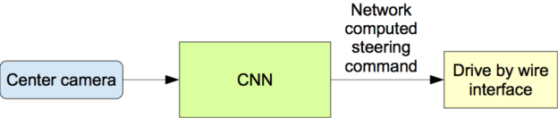

End-to-End deep learning using convolutional neural networks (CNNs) to map the raw pixels from (3) front-facing cameras to the steering commands for a self-driving car. A simulator was used to capture the images during training laps around a track with various turns, curb styles, heights and pavement. This powerful end-to-end approach means that with minimum training data from humans, the system learns to steer, with or without lane markings on roads.

Data Collection
---

Data collection was performed by driving a car in a simulator utilizing keyboard and mouse commands for steering and throttle. To collect data I drove the car along the centre-line of the road for two laps and recorded all of the images. I then drove the car along the centre-line in reverse on the same track for a single lap. Finally, to capture some edge cases, I wanted to steer close to borders of the road on turns, areas with no curb and walls on a bridge, returning to the centre as soon as I got to close. For each frame of the image, the feature or image was stored in a file & the corresponding label measurement for the steering angle was also captured via a driving log file `.csv`; `features` and `labels` were captured for a left, center and right positioned camera `160 x 320 x 3`  as illustrated.    
  

  

Data Augmentation
---  
After saving my data, I wanted to increase the amount of my data, therefore I `flipped` each frame of the video along the vertical axis, and correspondingly multiplied the ground truth measurement by -1 to correct for the flipped position.  

Additionally, using a `Cropping2D Layer` I was able to crop the images 75 pixels from the top of each frame and 20 pixels from the bottom. This was done to increase the performance time for the model to focus only on the areas that require training for the steering angle. As can be seen from the example image below, removing the area above the road with a background such as a sky, terrain and the hood of the car can aid in the model training more accurately and faster.  

  

 

Network Architecture
---    

Source: [NVIDIA](https://arxiv.org/pdf/1604.07316v1.pdf)  

Below is a network summary from Keras/TensorFlow displaying my model used.  Note that initially, I added only a single `dropout layer` at the top of the network, however, upon training with eventually what I deemed to be good data, I decided to apply one very early after the first `convolutional layer` to see if the model would improve, and it did!  The model can be viewed in `model.py`  

   
  

Mean Squared Error Loss / Adam Optimizer
---

The `Mean Squared Error, or MSE`, loss is the default loss to use for regression problems.

Mean squared error is calculated as the average of the squared differences between the predicted and actual values. The result is always positive regardless of the sign of the predicted and actual values and a perfect value is 0.0. The squaring means that larger mistakes result in more error than smaller mistakes, meaning that the model is punished for making larger mistakes.  

 

  

Autonomous Driving
---

Once my model was validated I ran my model utilizing `drive.py` and `model.h5` file generated by Keras.   An `.h5` file easily stores the weights and model configuration in a single file. Upon launching the simulator the vehicle began to accelerate to a set speed and was able to navigate the test track quite smoothly with no error.  This autonomous driving was performed by visualizing `features` from a single camera positioned on the center of the vehicle, utilizing the trained behavioural cloning network to predict the correct steering angle `label` for a given vehicle position in a lane.  A video of the performance of this model was recorded using `video.py` from each of the individual frames stored while running my model.  Additionally, a video `run.mp4` was created to show the vehicle navigating around the test track.    

  
     

  
